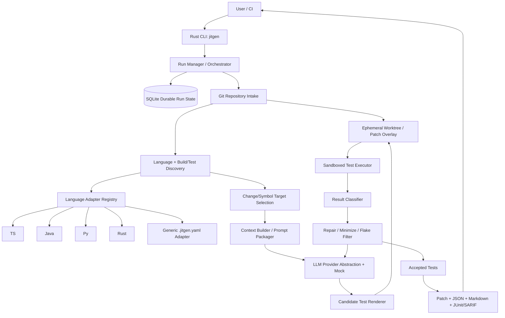

# jitgen Architecture

`jitgen` is a Just-in-Time (JIT) test generation system. When code changes in a git repository
(a diff, staged changes, or a commit range), it identifies the changed/affected code units, builds
bounded context, generates targeted runnable tests for **only** those changes, validates them in a
sandbox, classifies the result, and emits the outcome as a **patch** (default, non-destructive) —
writing into the target repo **only** on explicit `--write`.

It supports two modes (see [paper-notes.md](research/paper-notes.md) and
[ADR-0002](decisions/0002-catching-tests-refinement.md)):

- **`harden`** (default): generate tests that **pass** on `head` — safe to land.
- **`catch`**: generate tests that **fail** on `head` while **passing** on `base` (a *weak catch*),
  then assess whether the failure reveals a real bug (*strong catch*) or a test defect
  (*strictly-weak* / false positive). Catch artifacts are reported, never written as passing tests.

## Layer diagram



(Source of truth for the diagram: this file. A standalone copy lives in
[diagrams/layers.mmd](diagrams/layers.mmd).)

## Layers

Each layer is a Rust crate (default language; see [ADR-0001](decisions/0001-rust-default-and-bazel-monorepo.md)).
Per-layer language choices and their justifications are recorded as ADRs under `docs/decisions/`.

| # | Layer | Crate | Language | ADR |
|---|-------|-------|----------|-----|
| 1 | CLI / Presentation | `jitgen-cli` | Rust | [0001](decisions/0001-rust-default-and-bazel-monorepo.md) |
| 2 | Orchestration / Run-State | `jitgen-orchestrator`, `jitgen-state` | Rust + SQLite | [0005](decisions/0005-sqlite-durable-state.md) |
| 3 | Git intake | `jitgen-gitintake` | Rust (`git2`/libgit2) | [0006](decisions/0006-git-intake-libgit2.md) |
| 4 | Language discovery & adapters | `jitgen-adapters` | Rust (+ tree-sitter crates) | [0007](decisions/0007-tree-sitter-symbol-extraction.md) |
| 5 | Context / prompt packaging | `jitgen-context` | Rust | 0001 |
| 6 | LLM provider | `jitgen-llm` | Rust | [0008](decisions/0008-llm-provider-abstraction.md) |
| 7 | Candidate materialization | `jitgen-materialize` | Rust | 0001 |
| 8 | Sandboxed execution | `jitgen-sandbox` | Rust | [0003](decisions/0003-sandbox-strategy.md) |
| 9 | Feedback / repair / flake-filter / assessors | `jitgen-feedback` | Rust | [0002](decisions/0002-catching-tests-refinement.md) |
| 10 | Reporting / export | `jitgen-report` | Rust | 0001 |
| — | Core domain types | `jitgen-core` | Rust | 0001 |

> **Why Rust for every layer:** performance, predictable memory use, `#![forbid(unsafe_code)]`
> memory safety, a single coherent toolchain (no language sprawl), and a strong ecosystem for every
> concern we have (libgit2, tree-sitter, rusqlite, tokio/reqwest, serde). Language-specific test
> *rendering* and *execution* is delegated to each ecosystem's native toolchain (cargo, pytest,
> Maven/Gradle+JUnit, Jest/Vitest) invoked by Rust adapters — never by re-implementing those
> ecosystems in Rust. Any deviation requires an ADR.

### 1 — CLI / Presentation (`jitgen-cli`)
`clap`-based CLI exposing `run`, `analyze`, `resume`, `report`, `doctor`. Parses flags, resolves
config, constructs a run, and renders human-readable output. **Default is non-destructive**: emit a
patch/overlay; mutate the target repo only when `--write` is passed.

### 2 — Orchestration / Run-State (`jitgen-orchestrator` + `jitgen-state`)
Drives the JIT generation loop. State lives under a **state root** resolved as: `--state-dir` flag →
`JITGEN_STATE_DIR` → `$XDG_STATE_HOME/jitgen` → `~/.local/state/jitgen` (macOS: `~/Library/Application
Support/jitgen`), **outside the target repo** — a private **`0700`** dir; `run`, `resume`, and
`report` all refuse a state root that resolves inside the repo (incl. via a repo-planted symlink
ancestor), before trusting any stored config. The state root holds a **global run index**
(`index.sqlite`: run-id → repo, refs, mode, status, created_at) so `jitgen resume --run-id <id>` and
`jitgen report --run-id <id>` can locate a run **without** the caller re-specifying the repo. Per-run
state is `…/runs/<run-id>/state.sqlite` with: step id, inputs, content hashes, status
(`pending|running|succeeded|failed|skipped`), error, retry count, and artifact paths.

**Durability rules** (revised per F0/T1 review #4):
- **Atomic artifact publication:** every artifact/state file is written to a temp file in the same
  directory, `fsync`'d, then `rename`d into place (atomic on POSIX). The run index is updated in the
  same transaction boundary as the step it records.
- **Overlay lifecycle:** ephemeral overlays are **reconstructible** from `(base, head, candidate)`
  recorded in state, so an interrupted step rebuilds its overlay deterministically on resume. Overlays
  are created under a run-scoped temp root and **cleaned on retry/abandon**; a stale `running` step
  found at startup is treated as interrupted (its overlay is rebuilt, not trusted).
- Steps are idempotent / safely re-entrant; resume continues from the last `succeeded` checkpoint.

See [ADR-0005](decisions/0005-sqlite-durable-state.md).

### 3 — Git intake (`jitgen-gitintake`)
Opens an arbitrary repo via libgit2 (`git2`). **Peels `base`/`head` to immutable commit OIDs** (no
TOCTOU on moving refs). Computes the `base..head` diff, applies ignore/vendor filtering (`.git`,
`node_modules`, `target`, `dist`, `.env`, key/credential files…), and plans a **safe overlay** built
**from blobs with git filters disabled** (no smudge/clean/LFS/textconv) under a `jitgen`-owned root.
Writes use `openat`/`O_NOFOLLOW`/`O_EXCL` + post-open `fstat` (symlink/`..` escapes rejected); any
`git` CLI runs with inert HOME/config and hooks/filters/credential-helpers disabled. See
[ADR-0006](decisions/0006-git-intake-libgit2.md).

### 4 — Language discovery & adapters (`jitgen-adapters`)
Detects languages and build/test tooling, then dispatches to a `LanguageAdapter` (SPI below).
First-class adapters: **TypeScript, Java, Python, Rust**, plus a **generic `.jitgen.yaml`** adapter.
Uniform symbol extraction uses tree-sitter grammars (Rust crates). See
[ADR-0007](decisions/0007-tree-sitter-symbol-extraction.md).

### 5 — Context / prompt packaging (`jitgen-context`)
Builds a **bounded** `ContextBundle` for a target within a token budget: the changed symbol(s),
nearby code, existing tests, signatures, and (catch mode) the diff title/summary. Applies **secret
redaction** and excludes secret-bearing files. Renders **injection-resistant** prompt templates
(untrusted repo content is fenced/quoted and never interpreted as instructions).

### 6 — LLM provider (`jitgen-llm`)
A provider trait with a **deterministic mock** (default; no network, no keys) and optional real
providers (Anthropic / OpenAI-compatible / local). **Provider, base URL, key-env, and real-LLM
enablement are TRUSTED-config only** — a hostile repo cannot redirect egress. API keys come **only**
from the trusted-named env var; TLS verification always on; requests are redacted + size-capped.
Parses/validates candidate tests from model output. See
[ADR-0008](decisions/0008-llm-provider-abstraction.md).

### 7 — Candidate materialization (`jitgen-materialize`)
Renders a `TestCandidate` into a `MaterializedTest` placed **inside the overlay only**. Confinement is
`#![forbid(unsafe_code)]`-compatible pure-std ([ADR-0011](decisions/0011-overlay-materialization.md)):
lexical path validation (no absolute/`..`/`\`/drive prefix; length & nesting caps), **per-component
symlink rejection** while creating parent dirs, and a **crash-atomic install** — a uniquely-named
same-dir temp written with `O_CREAT|O_EXCL` (refuses a final-component symlink per POSIX), fsync'd,
then `rename`d into place (atomic; replaces a destination symlink without following it; never a
partial `dest`); no canonicalize-then-write. Idempotent for resume (byte-identical re-materialization
is a no-op via a length-then-sha256 check; differing content is a conflict; a non-regular destination
is refused). Per-language,
sanitized file placement (`*.test.ts`, `src/test/java/...`, `test_*.py`, Rust `tests/`). The residual
TOCTOU (a parent swapped between check and open) needs a concurrent local attacker — out of the threat
model; full `openat`/`O_NOFOLLOW` dirfd traversal is the F7 hardening.

### 8 — Sandboxed execution (`jitgen-sandbox`)
Runs the adapter's `test_command` under a **fail-closed** sandbox: untrusted execution **requires** an
OS sandbox (bubblewrap/firejail on Linux; `sandbox-exec` on macOS) or container (Docker/Podman); if
none is available, execution is **refused** unless the trusted user passes `--unsafe-local-execution`
(loud, recorded). **No network by default** (live conformance tests per backend; Podman shares the
Docker invocation plan); **hardcoded env
allowlist** with synthetic `HOME` (no inherited tokens/creds); cwd pinned to the overlay; mandatory
timeouts, output caps, and **per-backend** resource limits (containers via cgroup flags
`--memory`/`--pids-limit`/`--cpus`; firejail via `--rlimit-*`; OS-sandbox/constrained-local via a
`ulimit` preamble applying **CPU-time + address-space only** — process-count is intentionally omitted,
since `ulimit -u` is per-UID and the container `--pids-limit` + wall-clock timeout are the fork-bomb
controls); **preflight resource budgets** before sandboxing. **argv-only** execution; `shell: true` is trusted-config only and high-risk. See
[ADR-0003](decisions/0003-sandbox-strategy.md), [ADR-0010](decisions/0010-config-trust-and-fail-closed.md). **[MAX SCRUTINY]**

### 9 — Feedback / repair / flake-filter / assessors (`jitgen-feedback`)
Classifies execution outcomes, then repairs / filters / assesses. In `catch` mode the candidate is
executed on **both `base` and `head`** (a `CatchExecution`) so the relationship can be observed.

**`CatchClass` is execution-derived** (what we *observed*), distinct from the **assessment** (what we
*infer* about correctness — the oracle problem):

```rust
enum CatchClass {            // observed from running base+head
    HardenPass,              // passes on head (harden goal)
    WeakCatch,               // passes on base, fails on head  ← candidate catch
    NoCatch,                 // passes on both / fails on both in an uninteresting way
    Broken,                  // does not build/run
    Flaky,                   // nondeterministic across reruns
}

struct WeakCatchAssessment { // only for WeakCatch; produced by the assessor ensemble
    tp_probability: f64,                 // 0.0..=1.0
    bucket: TpBucket,                     // VeryLow|Low|Medium|High|VeryHigh
    decision: CatchDecision,             // StrongCatch | StrictlyWeak | Uncertain
    rationale: String,                   // redacted, human-readable
    signals: Vec<AssessorSignal>,        // per-assessor scores (rule-based + LLM)
}
```

A **strong catch** (true positive — real bug) vs a **strictly-weak catch** (false positive — test
defect) is never read off execution alone; it is the assessor `decision` over a `WeakCatch`, gated by
configurable `tp_probability` thresholds that also drive report ranking and acceptance.

A bounded **repair loop** feeds failure context back to the LLM (capped retries). A **flake filter**
re-runs to drop nondeterministic candidates. **Assessors** (rule-based + LLM-based ensemble, treated
as complementary signals per the paper) produce the `WeakCatchAssessment`. See
[ADR-0002](decisions/0002-catching-tests-refinement.md).

### 10 — Reporting / export (`jitgen-report`)
Emits a unified **patch** (default), plus **JSON** and **Markdown**, and optional **JUnit** and
**SARIF**. Reports include accepted tests, observed catch class, assessment decision/tp_probability/
rationale, and reproduction instructions. **Secrets are redacted** from all outputs, and untrusted
strings (test names, paths, failures, rationale) are **escaped per output format** (Markdown/HTML,
JUnit XML, SARIF JSON) with **control/ANSI characters stripped** and lengths capped — untrusted
content is always rendered as data, never markup or terminal controls.

## Adapter SPI

The SPI threads an **`AdapterContext`** (repo snapshot, resolved config, mode, pinned base/head
revisions) through each adapter call. `id()` returns an **owned `AdapterId`** so the generic adapter
can carry a dynamic id from `.jitgen.yaml`. The implemented trait is deliberately **small**: an adapter
**detects** its language and **maps changes to targets + an argv test command**. Everything else —
context packaging (layer 5), candidate materialization (layer 7), sandboxed execution (layer 8), and
result **classification** incl. the paired base+head `CatchClass` (layer 9) — is owned by dedicated
layers and the orchestrator, not by adapter methods.

```rust
pub struct AdapterContext<'a> {
    pub repo: &'a RepoSnapshot,     // files/blobs at the head revision (read-only)
    pub config: &'a ResolvedConfig, // trusted ⊕ untrusted (typed split; see config-trust tiers)
    pub mode: Mode,                 // Harden | Catch
    pub base: RevisionId,           // parent OID
    pub head: RevisionId,           // changed OID
}

pub trait LanguageAdapter {
    fn id(&self) -> AdapterId;                                              // owned; dynamic for generic
    fn detect(&self, repo: &RepoSnapshot) -> DetectionResult;
    fn analyze_changes(&self, ctx: &AdapterContext, changes: &ChangeSet) -> Vec<Target>;
    fn test_command(&self, ctx: &AdapterContext, target: &Target) -> Option<TestCommand>;
}
```

`TestCommand` is always an **argv list** (`{ program, args, cwd_rel, shell }`) — it carries **no environment
authority**. The execution environment is owned solely by the sandbox (a hardcoded allowlist +
synthetic `HOME`, plus any additions from `TrustedConfig`); an adapter/repo cannot widen it (F0/T2
review #1). A shell string is only produced when **trusted** config sets `shell: true` (flagged
high-risk; see security §5). Adapters never construct commands from LLM output.

- **TypeScript:** detect `package.json`/`tsconfig`/lockfiles; Jest & Vitest; npm/pnpm/yarn/bun;
  emit `*.test.ts` / `*.spec.ts`.
- **Java:** detect Maven/Gradle, JUnit 4/5; emit under `src/test/java`; targeted test runs.
- **Python:** detect pytest/unittest; prefer pytest; respect `tests/` conventions; `python -m pytest`.
- **Rust:** detect Cargo workspace; inline `#[cfg(test)]` or `tests/`; targeted `cargo test`.
- **Generic:** `.jitgen.yaml` is **untrusted repo config** (see config-trust tiers below). It may set
  only `id`, `extensions`, include/exclude globs, an explicit **`argv` template** for the test command
  (NOT a free-form string — see security §5), and test-file placement. Its `grammar` is a **name
  validated against a compiled-in allowlist** (never dynamically loaded). Its `prompt_hints` are
  treated as **fenced untrusted data**, never instructions. `shell: true`, provider selection, env
  expansion, and the state root are **ignored if present in repo config** — those are trusted-config
  only ([ADR-0010](decisions/0010-config-trust-and-fail-closed.md)).

## JIT generation loop (canonical pseudocode)

```text
run_jit_generation(repo, base, head, mode, strategy):
  run_id   = create_resumable_run()                                # global index + per-run sqlite
  changes  = git.diff(base, head)
  profile  = discover_languages_builds_tests(repo)
  for target in prioritized(select_targets(changes, profile)):     # risk-scored (DRS analogue)
    context = build_context_bundle(target, profile, token_budget)  # bounded; no secrets
    for candidate in generate_candidates(context, adapter_ctx, mode, strategy):
      class = run_and_classify(candidate, target, base, head, mode)  # CatchClass
      while repairable(class) and repair_budget_remaining:
        candidate = llm.repair_test(candidate, class); class = run_and_classify(...)
      if not (passes_static_validation(candidate) and passes_flake_filter(candidate)):
        reject(candidate, reason); continue
      if mode == harden and class == HardenPass: accept(candidate)
      elif mode == catch and class == WeakCatch:
        assessment = assessors.assess(candidate, class, context)   # rule-based + LLM ensemble
        report_catch(candidate, assessment)   # report-only; EVERY verdict is surfaced at a severity
                                               # (severity_of: Strong→error, Uncertain→warning,
                                               # StrictlyWeak→note). The findings GATE — not the report —
                                               # is what requires StrongCatch ≥ threshold (gate.rs, E4).
      else: reject(candidate, class)
  produce_patch_and_reports()

# Candidate generation depends on strategy:
generate_candidates(context, ctx, mode, strategy):
  if strategy == harden:        return llm.generate_tests(context, ctx)                 # pass-on-head
  if strategy == dodgy_diff:    return llm.generate_mutant_killing_tests(diff_as_mutant) # treat diff as bug
  if strategy == intent_aware:                                       # paper's risk→mutant→test pipeline
    risks   = llm.infer_diff_risks(context.diff_title, context.diff_summary, code)
    mutants = llm.make_mutants(risks, parent=base)                  # type: Mutant
    mutants = [m for m in mutants if builds(m) and passes_existing_tests(m)]  # valid mutants only
    tests   = [llm.gen_test_killing(m, parent=base) for m in mutants]         # pass on base, fail on mutant
    return tests                                                    # later replayed on head; failures = weak catches

run_and_classify(candidate, target, base, head, mode):
  overlay_head = materialize(candidate, head)                       # confined to allowed roots
  result_head  = sandbox.run(adapter.test_command(ctx, target), overlay_head)   # overlay → sandbox, not adapter
  if mode == catch:
    overlay_base = materialize(candidate, base)
    result_base  = sandbox.run(adapter.test_command(ctx, target), overlay_base)
    return classify_catch(CatchExecution{base: result_base, head: result_head})   # feedback layer (9)
  return classify_single(result_head)                                            # feedback layer (9)
```

## CLI surface

```text
jitgen run     --repo <path> --base <ref> --head <ref>
                 [--mode harden|catch] [--strategy auto|harden|dodgy-diff|intent-aware]
                 [--write | --patch-out <file>]            # harden mode only (see below)
                 [--language <id>] [--max-tests N]
jitgen analyze --repo <path> --base <ref> --head <ref> [--format human|json]
jitgen resume  --run-id <id>
jitgen report  --run-id <id> [--format human|json|markdown|junit|sarif]
jitgen doctor

# Global / TRUSTED options (CLI or user config file outside the repo only; never repo .jitgen.yaml):
  --state-dir <path>            # state root (else JITGEN_STATE_DIR / XDG)
  --config <file>               # trusted user/system config
  --sandbox <auto|bwrap|firejail|sandbox-exec|docker|podman|local>
  --unsafe-local-execution      # REQUIRED to use the no-isolation local tier (loud, recorded)
```

- **Non-destructive default:** emit a patch/overlay; mutate the target repo only with `--write`.
- **`--write`/`--patch-out` are invalid with `--mode catch`** (F0/T2 review #4): catching tests fail
  by design and cannot land, so catch mode is **report-only** (reproduction + assessment).
- **`--strategy` defaults** (F0/T2 review #3): `auto` ⇒ harden mode→`Harden`, catch mode→`IntentAware`;
  `dodgy-diff` is an explicit opt-in for broader (noisier) catch candidates.
- **`analyze`** (F0/T2 review #5) is **non-executing**: it reports the diff, detected languages/build
  tools, selected targets, and their risk scores (a dry-run plan). Default human output; `--format
  json` for machine use. It never runs tests, never calls a real LLM, and never writes to the repo.

## Configuration trust tiers

Because `.jitgen.yaml` lives inside the **hostile** repo, config is split at the **type level**
(`TrustedConfig` from CLI + `JITGEN_*` env vars + a user/system file outside the repo; `RepoConfig`
from `.jitgen.yaml`) and
`ResolvedConfig` only lets `RepoConfig` set a fixed non-security allowlist (extensions, globs, `argv`
template, allowlisted grammar name, fenced prompt hints). Security-relevant settings — LLM provider /
base URL / key-env / real-LLM, `shell: true`, the env allowlist, sandbox backend +
`--unsafe-local-execution`, and the state root — are **trusted-only**; a repo value can never reach
them. See [ADR-0010](decisions/0010-config-trust-and-fail-closed.md) and [security.md](security.md).

## Cross-cutting

- **Durability/resume:** [implementation-plan.md](implementation-plan.md) §Durability,
  [ADR-0005](decisions/0005-sqlite-durable-state.md).
- **Security/threat model:** [security.md](security.md). Execution is **fail-closed**; a tiered
  sandbox is required for untrusted commands ([ADR-0003](decisions/0003-sandbox-strategy.md),
  [ADR-0010](decisions/0010-config-trust-and-fail-closed.md)).
- **Build system:** Bazel (Bzlmod) canonical; Cargo workspace for dev ergonomics
  ([ADR-0001](decisions/0001-rust-default-and-bazel-monorepo.md)).
